# TechQuest Application

Tech Quest is an application whose difference is established through the gamification of the content presented with RPG concepts, where each mission includes important technological concepts for learning, such as programming logic and software development. The application is built using the back-end process as a managed service and takes advantage of the use of JavaScript and TypeScript languages. Furthermore, this work presents the application's trajectory in detail, explaining the origin of its idea, how it was refined and put into practical testing. The research offers a relevant contribution to the development of assistive technologies in the student world and seeks to benefit all those seeking new knowledge in the technological world.

## Features

- Authentication using Google

- Authentication using GitHub

- User registration and login with email/password

- Gamified onboarding with character selection

- Dynamic quizzes with immediate feedback

- Inventory management with RPG-style items

- Dungeon system with progressive difficulty quests

- Experience points and level progression system

## Layout

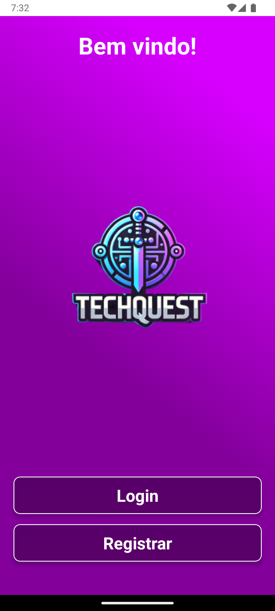


<br>


<br>
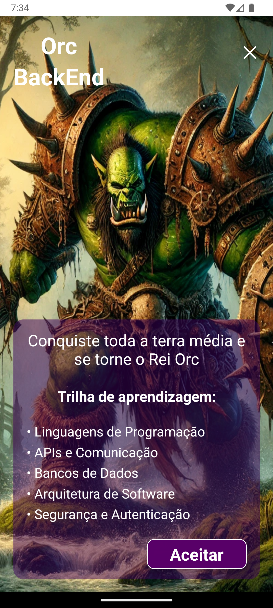
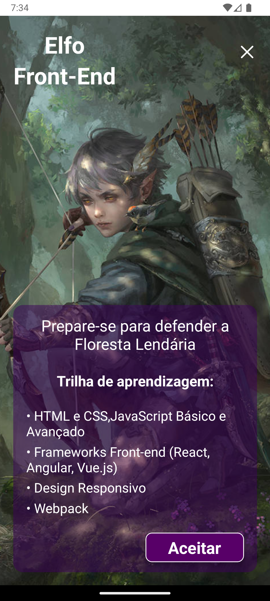

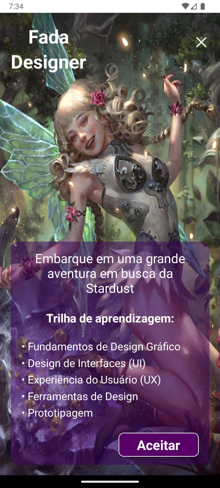
<br>
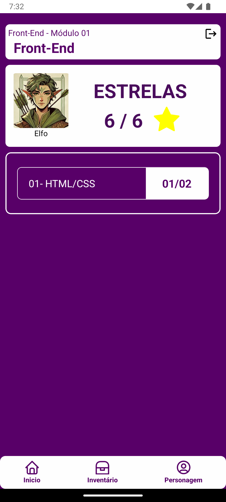
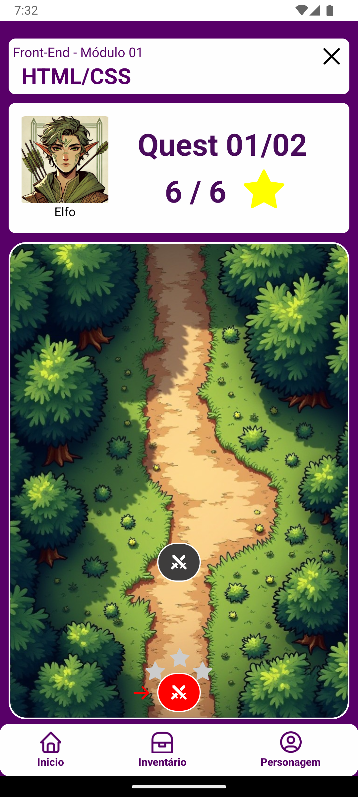
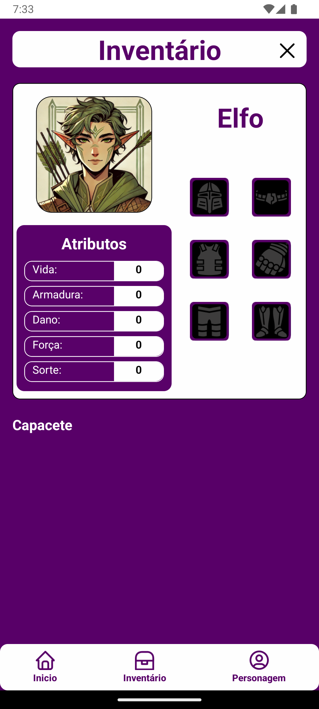
<br>
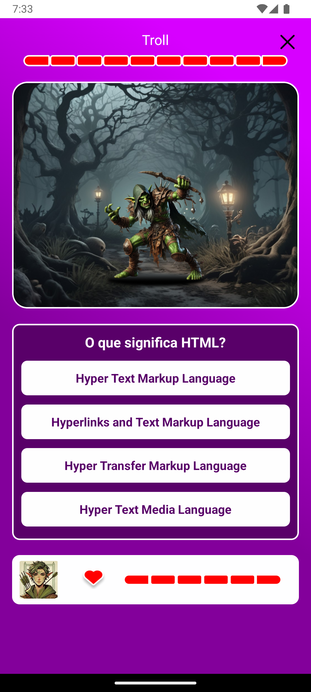
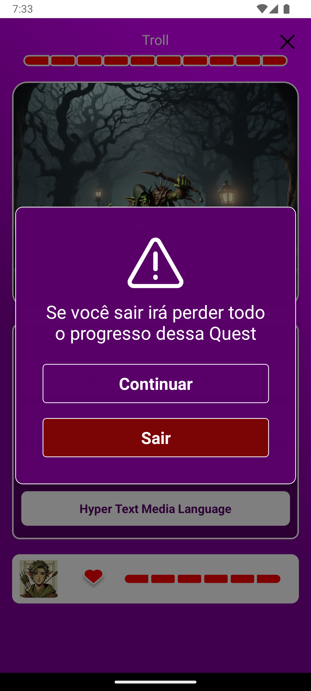

## DB Diagram && Application Architecture

_DB Diagram_

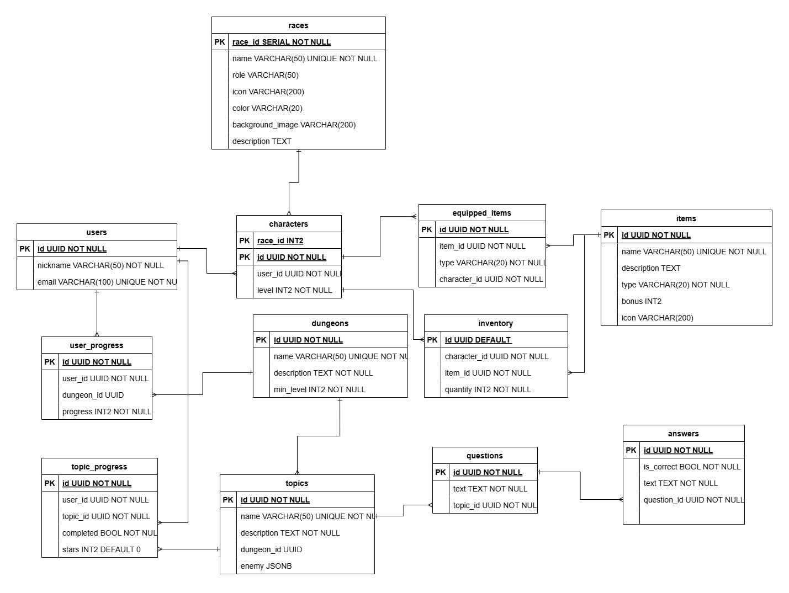

_Application Architecture_

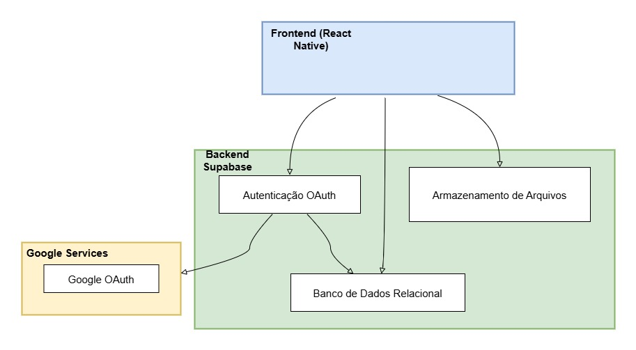

## Technologies

### Back-end

- Supabase

### Front-end

- React Native
- Expo

## Build and Execute

### Prerequisites

- Node
- Android Studio

### Clone the Repository

```bash
git clone https://github.com/lmiguelcardoso/TechQuest
```

### Install Dependencies

```bash
npm install
```

### Start the Development Server

```bash
npm run android
```

Or

```bash
npx expo start
```
